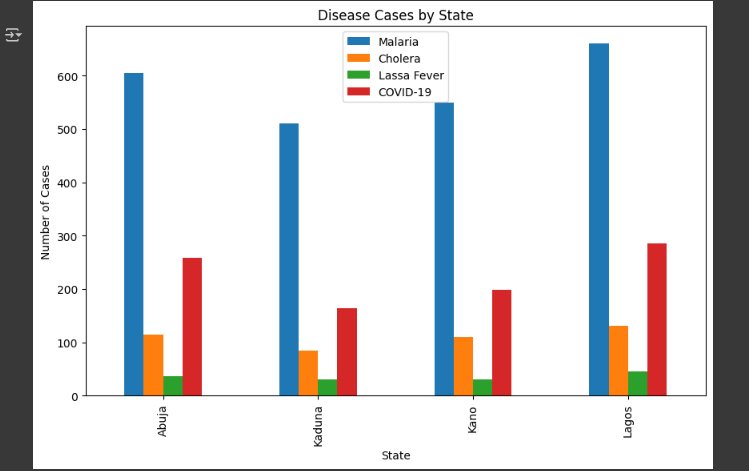
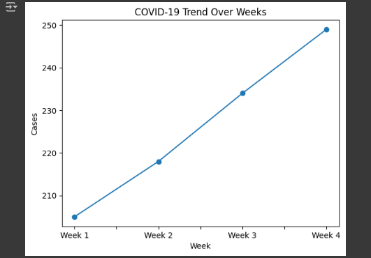

# 🇳🇬 Nigeria Disease Visualizer 🦠📊

A data visualization project that simulates the spread of diseases across Nigeria’s states using Python, Pandas, and Matplotlib.

---

## 📌 Project Overview

The **Nigeria Disease Visualizer** is a research-inspired tool visualizing disease case trends across Nigerian states. Ideal for exploring infection patterns and informing public health analysis.

---

## 🧠 Features

- Visualizes simulated disease counts across states  
- Includes bar charts, pie charts, and trend analysis  
- Demonstrates grouping, filtering, and plotting techniques

---

## 📸 Sample Visualizations

*Figure 1: Bar chart showing total cases per disease or per state*

 
*Figure 2: Line chart showing COVID‑19 trends over weeks*

 
*Figure 3: Pie chart of disease proportions*

---

## 🛠 Technologies Used

| Tool         | Description                        |
|--------------|------------------------------------|
| Python       | Code and data processing           |
| Pandas       | Data frame manipulation            |
| Matplotlib   | Chart plotting and visualization   |
| Google Colab | Notebook & cloud execution support |

---

## 🧪 How to Run

### 🟢 Option 1: Run in Google Colab
1. Click the **Open in Colab** badge (or go to Colab manually)  
2. Upload `disease_data.csv`  
3. Run all cells to generate the visualizations  
4. Confirm screenshots match those above

### ⚙️ Option 2: Run Locally
1. Clone the repo  
2. Install dependencies via `pip install -r requirements.txt`  
3. Launch `notebooks/disease_analysis.ipynb`  
4. Ensure `data/disease_data.csv` is in the correct directory

---

## 📁 Project Structure
nigeria-disease-visualizer/
├── data/
│ └── disease_data.csv
├── notebooks/
│ └── disease_analysis.ipynb
├── app/
│ └── streamlit_app.py
├── assets/
│ └── screenshots/
│ ├── bar_chart.png
│ ├── line_trend.png
│ └── pie_distribution.png
├── requirements.txt
└── README.md

---

## 🌱 Future Improvements

- Integrate real NCDC or WHO data
- Add predictive analytics (e.g., trend forecasts)
- Build deployable dashboard with Streamlit or Dash
- Include interactivity like filtering and tool‑tips

---

## 👤 Author

**Otuno David**  
B.Sc. Computer Science, Bingham University  
GitHub: [Otuno](https://github.com/Otuno)  
LinkedIn: [David Otuno](https://www.linkedin.com/in/david-otuno-785a29371)

---

## 🙏 Acknowledgements

Inspired by public health data projects and global outbreak visualizations. Thanks to peers and mentors who inspired this work.
