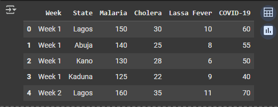

# Nigeria Disease Data Visualizer

This project uses a small mock dataset of disease case counts across Nigerian states to demonstrate basic data visualization using Python and Jupyter Notebook.

## Features
- Pie chart of total disease proportions
- Bar chart of disease counts by state
- Line graph of COVID-19 case trends by week

## Tools Used
- Python
- Jupyter Notebook
- Pandas
- Matplotlib

## Author
Otuno David — Bingham University (200 Level, Computer Science)  
GitHub: [https://github.com/Otuno](https://github.com/Otuno)
